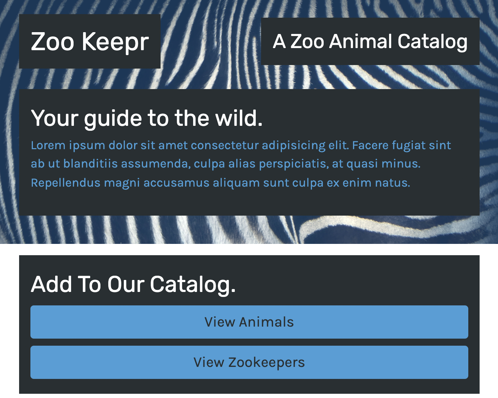

# Zookeepr
  
  
   

             
   

  ## TABLE OF CONTENTS

  ---

  [Description](#description) *
  [Usage](#usage) *
  [Questions](#questions) *

   

 
  
   

  ## Description

  ---

  This is an application to add Animal and Zookeeper infomation to a catalog. The added info can be view through the corresponding catalog links. 

   

  Deployment: https://warm-castle-73174.herokuapp.com/

   

  Repo: https://github.com/sihayah/zookeepr

## Usage

  ---

  To use, navigate to https://warm-castle-73174. Enter data into the forms, and use the catalog buttons to view the amended data.

   

  ## Questions

  ---

  For any further inquiries, please contact me via gitHub: [(sihayah)](https://github.com/sihayah) or email: sihaya_a@hotmail.com	

   

   
